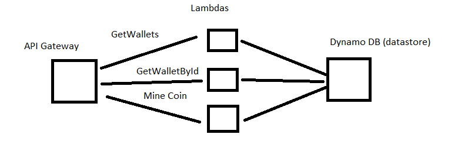

## Dinkum-Coin-API 
Dinkum-Coin-API is an hacky implementation of a fake crypo-currency which was created solely for the purpose of learning about, and experimenting with, continuous integration and deployment tools. 

To re-iterate, **_this is not a real crypo-currency project_**, it is a learning exercise only. 

Architecture:

The API is based on AWS serverless archecture and uses API Gateway, Lambdas and DynamoDB. 

The CI/CD process is build around Jenkins multibranch pipeline, [Nuke](http://http://www.nuke.build/) and docker containers.

